# Architecture Plan — Poker Application

## 1. Overview

The application is a **desktop program** (Wails + React) that serves two modes:

- **Poker Tips**: The existing chip management simulator. A local server starts and the host shares their IP so friends can connect and participate in a shared chip-tracking session.
- **Poker With Friends**: A full online poker game. The host creates a room, a local Fiber server starts, the host's IP:port is exposed (via UPnP or manual port-forwarding), and friends connect through their own instance of the app.

In both modes, the host's machine **is** the server. There is no centralized cloud backend. This is a peer-to-host model — identical to how Minecraft or Counter-Strike dedicated servers work.

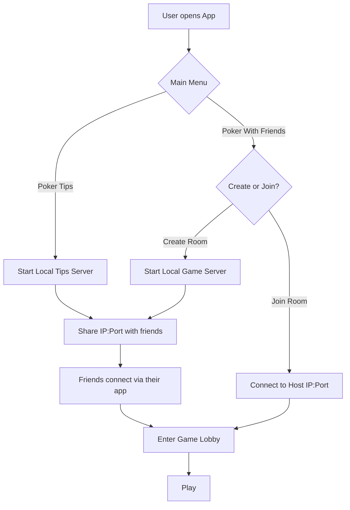

---

## 2. Feasibility & Network Strategy

### Why this works

The host starts an HTTP + WebSocket server on a configurable port (default `9876`). Clients connect to `host_ip:port`. This is the same model used by LAN games for 30+ years.

### NAT Traversal Strategy

| Method | Effort | Coverage | Notes |
|--------|--------|----------|-------|
| **LAN (same network)** | Zero | 100% of LAN | Works out of the box with local IP |
| **UPnP / NAT-PMP** | Low | ~70% of home routers | Automatic port mapping via `go-nat` library |
| **Manual port forwarding** | Medium | ~95% | User configures router; app shows instructions |
| **VPN (Hamachi, Tailscale, ZeroTier)** | Medium | 100% | Treated as LAN; no extra app logic needed |

**Decision**: Implement UPnP auto-mapping first, with a clear "Manual Setup" fallback screen showing the port and instructions. VPN usage is supported implicitly (the app just sees a LAN IP). A cloud relay server is **out of scope** — it contradicts the "no central server" design goal.

### Connection Info Display

When the host creates a room, the app shows:
- **Local IP** (for LAN play): `192.168.1.X:9876`
- **Public IP** (for internet play): `203.0.113.X:9876` (detected via STUN or HTTP IP service)
- **UPnP status**: "Port mapped automatically" or "Manual port forwarding required"
- **Copy button** for easy sharing

---

## 3. Service Decomposition

The monolith is split into four logical services, all compiled into a **single Wails binary**.

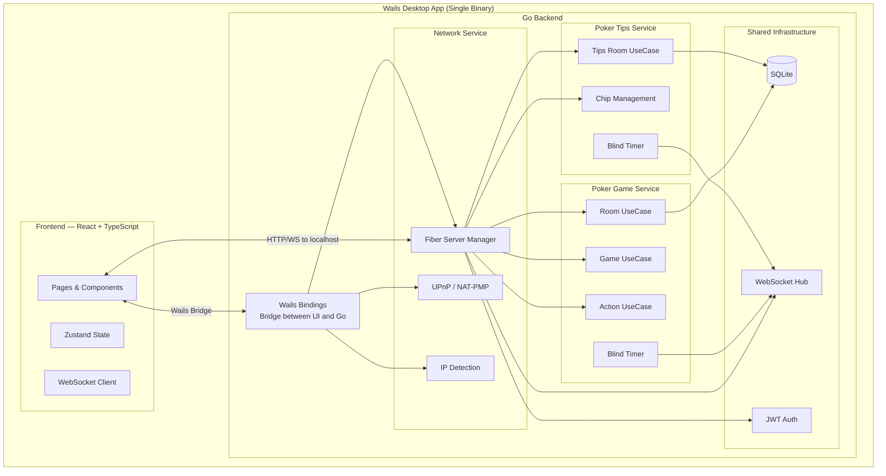

### Service Responsibilities

| Service | Responsibility |
|---------|---------------|
| **Network Service** | Start/stop the local Fiber server, UPnP port mapping, IP detection (local + public), connection health monitoring |
| **Poker Game Service** | Full poker game logic: rooms, rounds, actions, blinds, side pots, settlements. This is the core engine for "Poker With Friends" |
| **Poker Tips Service** | Chip simulator logic: room management, chip tracking, blind timer. Existing functionality for "Poker Tips" mode |
| **Frontend (Wails + React)** | Desktop UI with React, Zustand state, WebSocket real-time sync. Communicates via Wails bindings (local actions) and HTTP/WS (game state) |

---

## 4. Frontend Architecture

### Technology Choices

| Choice | Why |
|--------|-----|
| **Wails v2** | Native desktop app with Go backend + web frontend. Single binary, no Electron bloat (~10MB vs ~150MB). Native OS integration (file dialogs, system tray, menus). |
| **React 18 + TypeScript** | Already used in the existing frontend. Reuse components and knowledge. |
| **Zustand** | Already used. Lightweight, no boilerplate. Perfect for this scale. |
| **TailwindCSS v4** | Already used. Rapid UI development. |
| **React Router v6** | Already used. Client-side routing between modes and pages. |

### Page Structure

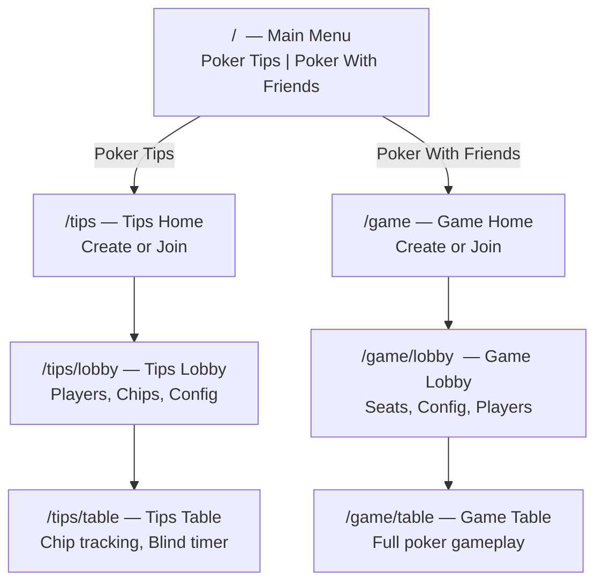

### Component Tree

```
App
├── MainMenuPage
│   ├── ModeCard (Poker Tips)
│   └── ModeCard (Poker With Friends)
│
├── Tips/
│   ├── TipsHomePage
│   │   ├── CreateRoomForm
│   │   └── JoinRoomForm
│   ├── TipsLobbyPage
│   │   ├── RoomCodeDisplay
│   │   ├── ConnectionInfo (IP:Port, UPnP status)
│   │   ├── PlayerList
│   │   ├── ChipConfig
│   │   └── BlindConfig
│   └── TipsTablePage
│       ├── PokerTable
│       ├── ChipTracker
│       ├── BlindTimer
│       └── PlayerList
│
├── Game/
│   ├── GameHomePage
│   │   ├── CreateRoomForm
│   │   └── JoinRoomForm (IP:Port input)
│   ├── GameLobbyPage
│   │   ├── RoomCodeDisplay
│   │   ├── ConnectionInfo (IP:Port, UPnP status)
│   │   ├── SeatPicker
│   │   ├── PlayerList
│   │   ├── GameConfig (host only)
│   │   └── StartGameButton (host only)
│   └── GameTablePage
│       ├── PokerTable
│       │   ├── PlayerSeat (x10)
│       │   ├── PotDisplay
│       │   ├── CommunityCards (future)
│       │   └── DealerButton
│       ├── ActionBar
│       │   ├── FoldButton
│       │   ├── CheckCallButton
│       │   ├── BetRaiseSlider
│       │   └── AllInButton
│       ├── BlindTimer
│       ├── HostControls
│       │   ├── AdvanceStreetButton
│       │   ├── SettleRoundButton
│       │   └── PauseButton
│       └── Modals
│           ├── SettlementModal
│           ├── RebuyModal
│           └── EliminatedOverlay
│
└── Shared/
    ├── ConnectionInfo
    ├── PlayerAvatar
    └── Toast
```

### State Management

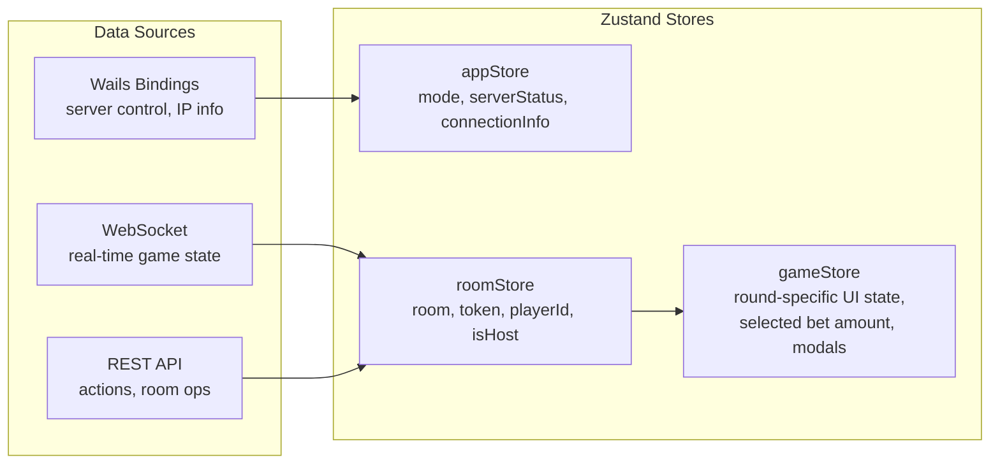

**Store responsibilities:**

- **appStore**: Application-level state. Current mode (tips/game), server running status, connection info (IPs, port, UPnP status). Populated via Wails bindings.
- **roomStore**: Room and game state. Mirrors the server Room entity. Updated via WebSocket broadcasts and HTTP responses. Same pattern as existing code.
- **gameStore**: Ephemeral UI state for the active game. Selected bet amount, which modal is open, action history for toasts. Derived from roomStore.

### Communication Patterns

The frontend communicates with the Go backend through **two channels**:

1. **Wails Bindings** (Go function calls from JS) — for local-only operations:
   - Start/stop server
   - Get connection info (IPs, port, UPnP status)
   - App settings and preferences

2. **HTTP + WebSocket** (to the local Fiber server) — for all game operations:
   - REST: create/join room, pick seat, perform action, etc.
   - WebSocket: real-time state broadcasts
   - This is the same for both host and remote clients

**Why not use Wails bindings for everything?** Because remote players connect to the host's Fiber server over the network. The host's frontend also connects to its own Fiber server (on localhost), keeping the code path identical for host and client. This eliminates divergent logic.

---

## 5. Backend Architecture (Clean Architecture)

### Layer Diagram

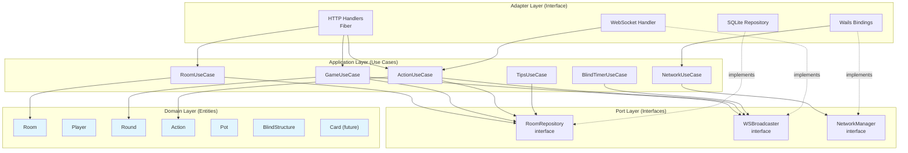

### Dependency Rule

Dependencies point **inward only**:

```
Adapter → Application → Domain
           ↓
          Port (interfaces)
           ↑
Adapter (implements)
```

- **Domain** has zero external dependencies. Pure Go structs and business rules.
- **Application** depends only on Domain and Ports (interfaces).
- **Adapters** implement Port interfaces and depend on Application layer.

### Project Structure

```
pokertipssimulator/
├── main.go                          # Wails entry point
├── wails.json                       # Wails configuration
├── build/                           # Build assets (icons, info.plist)
│
├── frontend/                        # React application
│   ├── src/
│   │   ├── App.tsx
│   │   ├── main.tsx
│   │   ├── pages/
│   │   │   ├── MainMenuPage.tsx
│   │   │   ├── tips/
│   │   │   │   ├── TipsHomePage.tsx
│   │   │   │   ├── TipsLobbyPage.tsx
│   │   │   │   └── TipsTablePage.tsx
│   │   │   └── game/
│   │   │       ├── GameHomePage.tsx
│   │   │       ├── GameLobbyPage.tsx
│   │   │       └── GameTablePage.tsx
│   │   ├── components/
│   │   │   ├── shared/             # ConnectionInfo, PlayerAvatar, Toast
│   │   │   ├── table/              # PokerTable, PlayerSeat, PotDisplay
│   │   │   ├── actions/            # ActionBar, BetSlider
│   │   │   ├── lobby/              # SeatPicker, PlayerList, GameConfig
│   │   │   └── host/               # HostControls, SettlementModal
│   │   ├── store/
│   │   │   ├── appStore.ts
│   │   │   ├── roomStore.ts
│   │   │   └── gameStore.ts
│   │   ├── services/
│   │   │   ├── api.ts              # REST client
│   │   │   ├── wsClient.ts         # WebSocket client
│   │   │   └── wsMessageHandler.ts
│   │   ├── hooks/
│   │   │   ├── useWebSocket.ts
│   │   │   └── useGameActions.ts
│   │   └── types/
│   │       └── index.ts
│   ├── wailsjs/                    # Auto-generated Wails bindings
│   ├── index.html
│   ├── package.json
│   ├── tsconfig.json
│   └── vite.config.ts
│
├── internal/
│   ├── domain/                      # DOMAIN LAYER — zero dependencies
│   │   ├── entity/
│   │   │   ├── room.go             # Room aggregate root
│   │   │   ├── player.go           # Player entity
│   │   │   ├── round.go            # Round, PlayerState
│   │   │   ├── action.go           # Action value object
│   │   │   ├── pot.go              # Pot, side pot logic
│   │   │   ├── blind.go            # BlindStructure, BlindLevel
│   │   │   ├── chipset.go          # ChipSet, denominations
│   │   │   └── errors.go           # Domain errors
│   │   └── event/
│   │       └── events.go           # Domain events (for WS broadcast)
│   │
│   ├── application/                 # APPLICATION LAYER — depends on domain + ports
│   │   ├── port/
│   │   │   ├── repository.go       # RoomRepository interface
│   │   │   ├── broadcaster.go      # WSBroadcaster interface
│   │   │   └── network.go          # NetworkManager interface
│   │   ├── dto/
│   │   │   ├── request.go          # Request DTOs
│   │   │   └── response.go         # Response DTOs
│   │   ├── room_usecase.go         # CreateRoom, JoinRoom, UpdateConfig
│   │   ├── game_usecase.go         # StartRound, AdvanceStreet, Settle
│   │   ├── action_usecase.go       # ProcessAction, validate, advance turn
│   │   ├── blind_timer.go          # Blind level auto-advancement
│   │   ├── tips_usecase.go         # Poker Tips chip management
│   │   └── network_usecase.go      # Start/stop server, get connection info
│   │
│   ├── adapter/                     # ADAPTER LAYER — implements ports
│   │   ├── handler/
│   │   │   ├── room_handler.go     # HTTP room endpoints
│   │   │   ├── game_handler.go     # HTTP game endpoints
│   │   │   ├── action_handler.go   # HTTP action endpoint
│   │   │   ├── tips_handler.go     # HTTP tips endpoints
│   │   │   ├── ws_handler.go       # WebSocket upgrade + handling
│   │   │   └── error_handler.go    # Centralized error mapping
│   │   ├── ws/
│   │   │   ├── hub.go              # Room-based WS hub
│   │   │   ├── client.go           # Per-connection client
│   │   │   └── message.go          # Message types + envelope
│   │   ├── repository/
│   │   │   └── sqlite_room.go      # SQLite RoomRepository impl
│   │   ├── network/
│   │   │   ├── server.go           # Fiber server lifecycle
│   │   │   ├── upnp.go             # UPnP/NAT-PMP port mapping
│   │   │   └── ip.go               # Local + public IP detection
│   │   └── wails/
│   │       └── bindings.go         # Wails-exposed Go methods
│   │
│   └── infrastructure/
│       ├── database/
│       │   └── sqlite.go           # SQLite connection + migrations
│       ├── config/
│       │   └── config.go           # App configuration
│       └── auth/
│           └── jwt.go              # JWT generation + validation
│
└── pkg/                             # Shared utilities
    ├── idgen/
    │   └── idgen.go                # ID generation
    └── validator/
        └── validator.go            # Input validation
```

### API Design

All endpoints are served by the host's local Fiber server. Both the host (via localhost) and remote clients (via host IP) hit the same endpoints.

#### Poker With Friends — REST Endpoints

```
Public (no auth):
  POST   /api/v1/game/rooms              → Create room
  POST   /api/v1/game/rooms/join          → Join room (by code)

Authenticated (Bearer JWT):
  GET    /api/v1/game/rooms/:roomId                          → Get room state
  PUT    /api/v1/game/rooms/:roomId/config                   → Update config (host)
  PUT    /api/v1/game/rooms/:roomId/players/:playerId/seat   → Pick seat
  POST   /api/v1/game/rooms/:roomId/rounds/start             → Start round (host)
  POST   /api/v1/game/rooms/:roomId/rounds/advance           → Advance street (host)
  POST   /api/v1/game/rooms/:roomId/rounds/settle            → Settle round (host)
  POST   /api/v1/game/rooms/:roomId/pause                    → Pause game (host)
  POST   /api/v1/game/rooms/:roomId/action                   → Perform action
  POST   /api/v1/game/rooms/:roomId/players/:playerId/rebuy  → Rebuy (cash)
  DELETE /api/v1/game/rooms/:roomId/players/:playerId        → Kick player (host)

WebSocket:
  GET    /ws?token=<jwt>                  → Real-time game state
```

#### Poker Tips — REST Endpoints

```
Public:
  POST   /api/v1/tips/rooms               → Create tips room
  POST   /api/v1/tips/rooms/join           → Join tips room

Authenticated:
  GET    /api/v1/tips/rooms/:roomId                          → Get room state
  PUT    /api/v1/tips/rooms/:roomId/config                   → Update config (host)
  PUT    /api/v1/tips/rooms/:roomId/players/:playerId/seat   → Pick seat
  POST   /api/v1/tips/rooms/:roomId/chips/transfer           → Transfer chips
  POST   /api/v1/tips/rooms/:roomId/players/:playerId/rebuy  → Rebuy
  POST   /api/v1/tips/rooms/:roomId/blinds/advance           → Advance blind level
  POST   /api/v1/tips/rooms/:roomId/pause                    → Pause timer
  DELETE /api/v1/tips/rooms/:roomId/players/:playerId        → Kick player (host)

WebSocket:
  GET    /ws?token=<jwt>                  → Shared with game mode
```

### WebSocket Message Protocol

Envelope format (unchanged from current):

```json
{
  "type": "message_type",
  "payload": { ... },
  "timestamp": 1700000000000
}
```

**Inbound (client → server):**

| Type | Payload | Description |
|------|---------|-------------|
| `action` | `{ type, amount }` | Player performs game action |
| `ping` | `{}` | Keepalive |

**Outbound (server → client):**

| Type | Payload | Description |
|------|---------|-------------|
| `room_state` | `Room` | Full room state snapshot |
| `player_joined` | `Player` | New player joined |
| `player_left` | `{ player_id }` | Player left/kicked |
| `round_started` | `Room` | New round began |
| `turn_changed` | `{ player_id }` | It's someone's turn |
| `action_performed` | `Action` | An action was taken |
| `street_advanced` | `Room` | Street progressed |
| `pots_updated` | `Pot[]` | Pots recalculated |
| `stack_updated` | `{ player_id, stack }` | Stack changed |
| `settlement` | `Room` | Round settled |
| `round_ended` | `Room` | Round complete |
| `blind_level_changed` | `BlindLevel` | Blind level advanced |
| `game_paused` | `{}` | Game paused |
| `game_resumed` | `{}` | Game resumed |
| `connection_info` | `{ local_ip, public_ip, port, upnp }` | Server network info |
| `error` | `{ message }` | Error notification |
| `pong` | `{}` | Keepalive response |

### Database

**SQLite only** — no MongoDB. This is a local desktop application; SQLite is the right tool.

```sql
-- Room state (full JSON document, same as current SQLite impl)
CREATE TABLE rooms (
    id         TEXT PRIMARY KEY,
    code       TEXT UNIQUE NOT NULL,
    mode       TEXT NOT NULL DEFAULT 'game',  -- 'game' or 'tips'
    data       TEXT NOT NULL,                  -- Full Room JSON
    created_at TIMESTAMP DEFAULT CURRENT_TIMESTAMP,
    updated_at TIMESTAMP DEFAULT CURRENT_TIMESTAMP
);

-- App settings (persisted between sessions)
CREATE TABLE settings (
    key   TEXT PRIMARY KEY,
    value TEXT NOT NULL
);
```

The Room document is stored as a JSON blob, serialized/deserialized on each operation. This is the same approach as the current SQLite implementation — simple, sufficient for the expected scale (1 room per running instance, ~10 players).

**Trade-off**: JSON blob means no SQL queries on game state fields. This is acceptable because we never need to query across rooms — each running instance hosts one room at a time. If we needed multi-room search, we'd normalize.

---

## 6. Network Service — Detailed Design

### Server Lifecycle

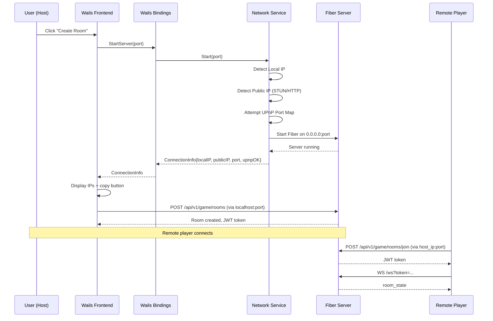

### NetworkManager Interface (Port)

```go
type ConnectionInfo struct {
    LocalIP   string `json:"local_ip"`
    PublicIP  string `json:"public_ip"`
    Port      int    `json:"port"`
    UPnPOK    bool   `json:"upnp_ok"`
}

type NetworkManager interface {
    StartServer(port int) (ConnectionInfo, error)
    StopServer() error
    GetConnectionInfo() ConnectionInfo
    IsRunning() bool
}
```

### UPnP Flow

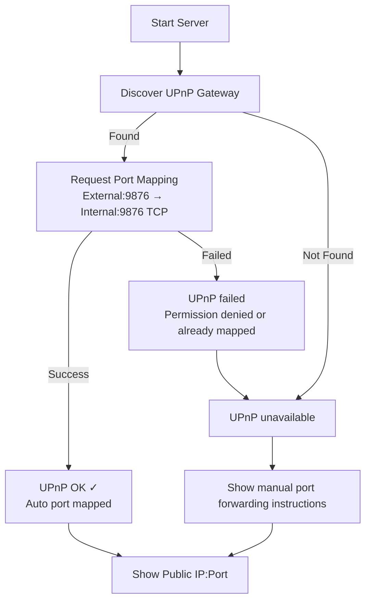

### IP Detection

- **Local IP**: Dial UDP to `8.8.8.8:80` (no actual connection), read local address from socket. Works on all platforms without external requests.
- **Public IP**: HTTP GET to a lightweight IP-echo service (e.g., `https://api.ipify.org`) or STUN request. Cached for the session.
- **Fallback**: If public IP detection fails, show only local IP and note that internet play requires manual setup.

---

## 7. User Flows

### Host Creates a Game Room

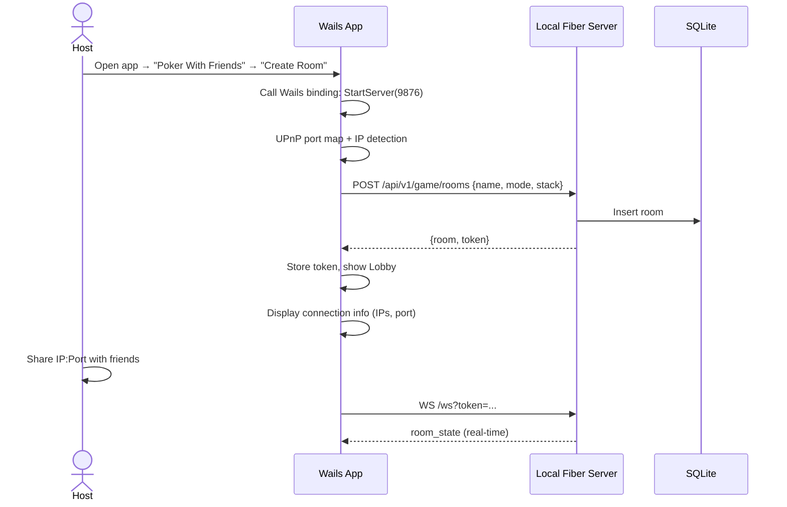

### Remote Player Joins

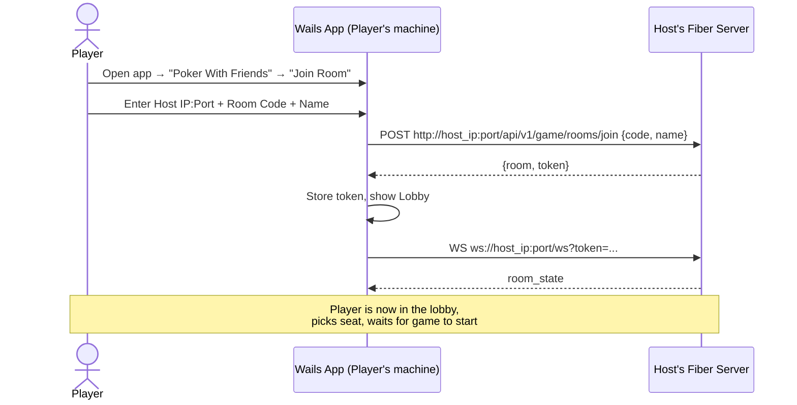

### Game Round Flow

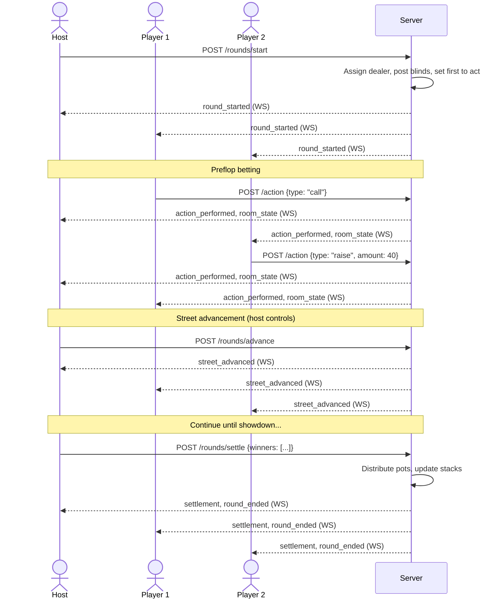

---

## 8. Key Architectural Decisions

### Decision 1: Single Binary (Wails) vs. Separate Server + Client

**Chosen: Single Wails binary.**

| Option | Pro | Con |
|--------|-----|-----|
| Wails (chosen) | One download, one app. Host and client are the same binary. Simple distribution. | Heavier than a pure CLI server. |
| Separate server binary + web client | Lighter server. Clients use a browser. | Two artifacts to distribute. Worse desktop integration. |

Wails wins because the target audience is friends playing poker — they want to download one thing and click play, not run a server and open a browser.

### Decision 2: SQLite vs. MongoDB

**Chosen: SQLite only.**

MongoDB was used for the Docker-based dev setup. In a local desktop app, SQLite is the natural choice:
- Zero configuration, embedded in the binary
- Single-file database
- No Docker dependency
- Sufficient for 1 room, ~10 players

### Decision 3: REST + WebSocket vs. Pure WebSocket

**Chosen: REST for mutations, WebSocket for real-time state.**

Keeping REST for actions (create room, perform action, etc.) and WebSocket for broadcasts. This is the current pattern and it works well:
- REST gives us proper HTTP status codes, request/response semantics, and easier debugging
- WebSocket gives us push-based real-time updates
- Both host and remote clients use the same HTTP/WS endpoints

### Decision 4: Host-as-Server vs. Relay Server

**Chosen: Host-as-server.**

The host's machine runs the Fiber server. No cloud infrastructure. Trade-offs:

| Aspect | Host-as-server | Cloud relay |
|--------|---------------|-------------|
| Cost | Free | Server costs |
| Latency | Direct connection | Extra hop |
| Availability | Host must be online | Always available |
| NAT traversal | UPnP + manual | Handled by relay |
| Complexity | Lower | Higher |
| Privacy | Data stays local | Data through cloud |

For a friends-playing-poker scenario, host-as-server is simpler and free. The host being online is a given (they're playing too).

### Decision 5: Auth — JWT with Room-Scoped Claims

**Kept from current design.** JWT with `{ room_id, player_id, is_host }` claims, 24-hour expiry. No user accounts, no persistent identity. A player's identity exists only within a room session. This is appropriate for casual friend games.

### Decision 6: Game State as JSON Blob in SQLite

**Kept from current design.** The entire Room (with embedded round, players, actions) is stored as a single JSON document. Pros:
- Simple read/write (one query)
- Atomic updates (replace entire document)
- No ORM complexity

Cons:
- No field-level queries (acceptable — we never query across rooms)
- No optimistic locking (acceptable — single host, sequential requests)

### Decision 7: Poker Tips and Poker Game Share Infrastructure

Both modes use the same:
- Fiber server
- WebSocket hub
- SQLite database
- JWT auth
- Wails bindings

They differ only in use cases and handlers. This avoids code duplication and lets us reuse the network service, connection info display, and player management UI.

---

## 9. Migration Strategy

### What Changes From Current Codebase

| Area | Current | After Refactor |
|------|---------|---------------|
| **Deployment** | Docker Compose (backend + frontend + MongoDB) | Single Wails desktop binary |
| **Frontend framework** | Vite dev server / embedded SPA | Wails-embedded React |
| **Database** | MongoDB (primary) + SQLite (fallback) | SQLite only |
| **Entry point** | `backend/cmd/server/main.go` (Fiber server) | `main.go` (Wails app that starts Fiber internally) |
| **Network** | User runs server, connects via browser | App handles server lifecycle + UPnP |
| **Project structure** | `backend/` + `frontend/` separation | Wails project structure (Go root + `frontend/` dir) |
| **Modes** | Single mode (chip simulator) | Two modes: Poker Tips + Poker With Friends |

### What Gets Reused

| Component | Reuse Level | Notes |
|-----------|-------------|-------|
| Domain entities | ~90% | Room, Player, Round, Action, Pot, Blind — mostly unchanged |
| Use cases | ~80% | Room, Game, Action, BlindTimer — refactored into clean architecture layers |
| Handlers | ~70% | Same REST endpoints, adapted for two route groups |
| WebSocket hub/client | ~90% | Nearly identical |
| React components | ~60% | PokerTable, ActionBar, SeatPicker reused; new pages for main menu and mode selection |
| Zustand stores | ~70% | roomStore mostly reused; new appStore for mode/server state |
| SQLite repository | ~95% | Already implemented, add `mode` column |

### What's New

| Component | Description |
|-----------|-------------|
| Wails integration | `main.go` entry point, bindings, build config |
| Network Service | UPnP, IP detection, server lifecycle management |
| Main Menu UI | Mode selection page |
| Connection Info UI | IP display, copy button, UPnP status |
| Tips-specific use cases | Chip transfer, independent blind management |
| Join by IP:Port | Frontend form + API client configured with host address |

---

## 10. Technology Stack Summary

| Layer | Technology | Version | Justification |
|-------|-----------|---------|---------------|
| Desktop Framework | Wails | v2 | Go + web frontend, single binary, native feel |
| Backend Language | Go | 1.23+ | Existing codebase, excellent for networking |
| HTTP Framework | Fiber | v2 | Existing codebase, fast, Express-like API |
| WebSocket | Gorilla WebSocket | v1.5+ | Existing codebase, battle-tested |
| Database | SQLite | via `modernc.org/sqlite` | Pure Go, no CGO, embedded |
| Auth | JWT | `golang-jwt/jwt` | Existing codebase, stateless |
| UPnP | `huin/goupnp` or `jackpal/gateway` | Latest | Automatic port mapping |
| Frontend Framework | React | 18 | Existing codebase |
| Frontend Language | TypeScript | 5+ | Existing codebase, type safety |
| State Management | Zustand | 4+ | Existing codebase, lightweight |
| Styling | TailwindCSS | v4 | Existing codebase |
| Routing | React Router | v6 | Existing codebase |
| Build | Wails CLI | v2 | Cross-platform builds (Windows, macOS, Linux) |

---

## 11. Build & Distribution

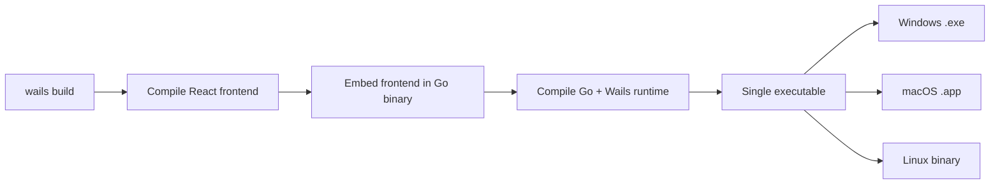

**Single command**: `wails build` produces a native executable per platform. The React frontend is embedded at compile time. No Docker, no server setup, no `npm install` at runtime.

**Cross-compilation**:
```makefile
build-windows:  wails build -platform windows/amd64
build-macos:    wails build -platform darwin/arm64
build-linux:    wails build -platform linux/amd64
```
